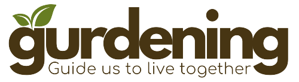
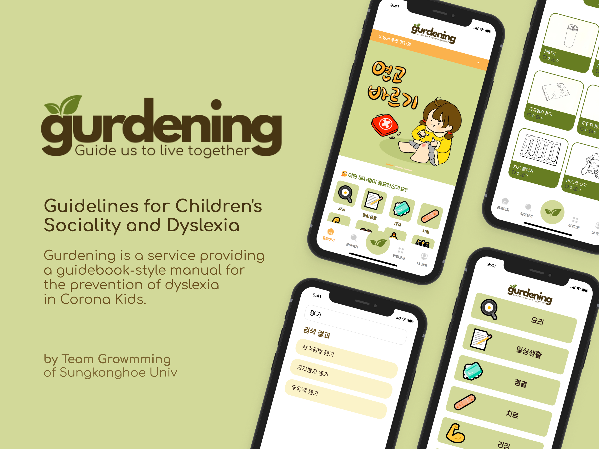
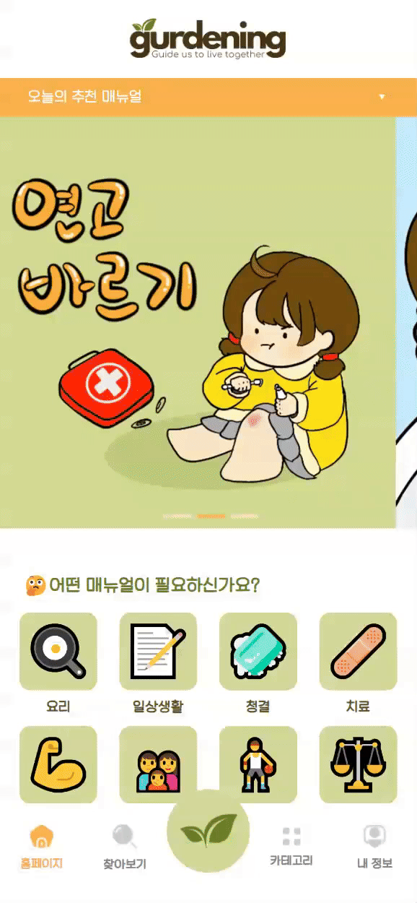
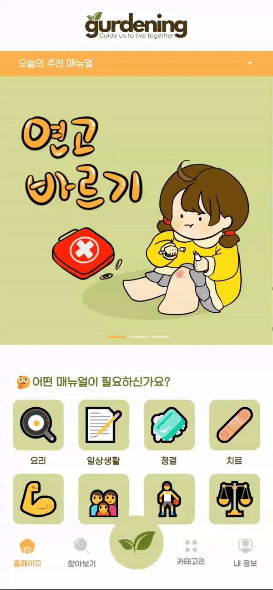
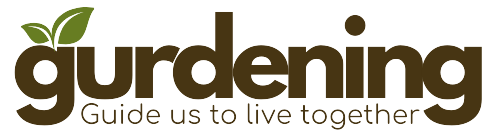
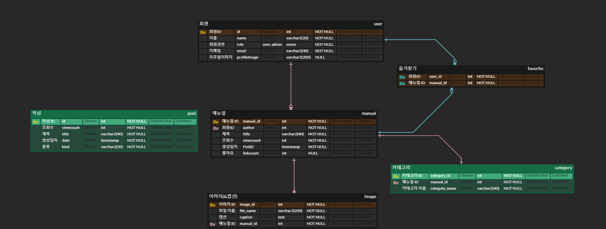

<!-- 영어 번역기나 뤼튼, 지피티 돌릴 때 좋은 결과를 얻기 위해서 한국어 말투가 좀 어색할 수 있습니다~~~-->

### Google Developer Student Clubs 2024 Solution Challenge   Team Growmming <b>Gurdening</b> FrontEnd

<i><b>2023. 12. 01 ~ 2024. 02. 22</b></i>
  

  

  <table>
    <tr>
      <td align="center" colspan="3">
        <b>Project Resources</b>
      </td>
    </tr>
    <tr>
      <td><a href="https://gurdening.vercel.app">View in Web</a></td>
      <td><a href="https://drive.google.com/file/d/1s2QVXdCUOvf5_rZIxgLwhy5MoawCVlCu/view?usp=drive_link">
        Download mobile app</a></td>
      <td><a href="https://gurdening.duckdns.org/swagger-ui/index.html">Documentation</a></td>
    </tr>
  </table>
  

  
  # Guidelines for Children's Sociality and Dyslexia

  <blockquote>
    Gurdening is a service providinga guidebook-style manual forthe prevention of dyslexia in Corona Kids. 
    Our service is a combination of the words 'Gu' from 'Guide' and '-dening' from 'Gardening', 
    which means cultivating the brain, the garden of knowledge, through the manual 
    We hope that our services will help ‘guide to live together’!
  </blockquote>

   
   

## Our Selection Within the UN's 17 sustainable development goals

  <table style="text-align: center; width:90%;">
    <tr>
      <td>
        
      </td>
      <td>
        
      </td>
    </tr>
  </table>
   
  <blockquote>
    <h3>
    We selected Goals No. 4 (Quality Education) and No. 10 (Reduced Inequalities) for our project. 
    </h3>
    
This is because we thought that because our service produces 'educational resources', quality education could be solved, and inequality could be solved by providing it to children who are vulnerable to information.

  </blockquote>
   

# About our Project

  
    
  <table style="text-align: center;">
    <tr>
      <td colspan="2" align="center">
        <b>Primary Feature</b>
      </td>
    </tr>
    <tr>
      <td align="center" ><b>Home</b></td>
      <td align="center" ><b>Search</b></td>
    </tr>
    <tr>
      <td></td>
      <td></td>
    </tr>
    <tr>
      <td style="width:50%">
        

          When the user enters our app, there is a 'Today's Recommendation Manual' banner and manual category on the main screen. 
          There is a navigation bar at the bottom. 
          The navigation bar consists of homepages, browsing, categories, and my information.
        

      </td>
      <td style="width:50%">
        
Click the Browse icon to search for manual writing.

      </td>
    </tr>
    <tr>
      <td align="center" style="max-width:50%"><b>Category</b></td>
      <td align="center" style="max-width:50%"><b>MyPage</b></td>
    </tr>
    <tr>
      <td></td>
      <td></td>
    </tr>
    <tr>
      <td style="width:50%">
        

          Click the Category icon to view the entire category. 
          You can also click each category to view the entire manual text that corresponds to it.
        

      </td>
      <td style="width:50%">
        

          Click the My Information icon to log in. 
          If you are logged in, you can use the History and Bookmark features.
        

      </td>
    </tr>
  </table>
  
  ## Tech Stack

  

  <h2>Our Selection Within the UN's 17 sustainable development goals</h2>

  

  
  <h1 style = "display:flex;align-items:center;margin-top:25px"><b>Growmming/Gurdening</b></h1>
  

  

    <h3><b>Gurdening - Guidelines for Children's Sociality and Dyslexia</b></h3>
    
  

 
    
    
| <a href="https://gurdening.vercel.app">View in Web</a> | <a href="https://gurdening.duckdns.org/swagger-ui/index.html">Documentation</a> | <a href="다운로드 링크">Download mobile app</a> |
|:---------:|:---------:|:---------:|

<h2>Our Selection Within the UN's 17 sustainable development goals</h2>

    
    

<h3>
  We selected Goals No. 4 (Quality Education) and No. 10 (Reduced Inequalities) for our project. 
</h3>

This is because we thought that because our service produces 'educational resources', quality education could be solved, and inequality could be solved by providing it to children who are vulnerable to information.

## About our Project

 
<a href = "우리 유튜브 영상">
</a>

<!-- TechStack -->

## Tech Stack

  <h3><b>Server</b></h3>
    
</img>
    
    
    
    

   
  <h3><b>Web</b></h3>
    

    
    
    
    

   
  <h3><b>Mobile</b></h3> <!--expo 추가요망-->
    

    
    
    

## Our architecture

<!---->

## Google Tech we use

<h3> GCP was selected for server operations due to its flexibility in time and location, 
  while Firebase was chosen for its simplicity in hosting images.
</h3>
    

    
    
    

   

## Google Cloud Platform

GCP was used for user identification and safety of our service with flexible server operation and Google login support through OAuth2.

## Firebase

Firebase was used to host images in the manual, which is the core of our service. This allows us to help users understand by providing them with a contextual picture.

## Database ERD

 

## Features

## Current / Next Steps

| [O] Achievement                                                                        | [X] Scalability                                               |
| :------------------------------------------------------------------------------------- | :------------------------------------------------------------ |
| 1. 10 manual articles produced by developers themselves                                | 1. Increase the number of views when viewing manual articles  |
| 2. Implementation of the manual banner recommended by the developer on the main screen | 2. Manual 'Like' function                                     |
| 3. Directly to the corresponding manual via the main banner                            | 3. Google OAuth2 login function                               |
| 4. Manual inquiry function                                                             | 4. Bookmark function to save the manual you want to see again |
| 5. Manual search function                                                              |                                                               |
| 6. Implementation of unlimited scrolling of manual writing                             |                                                               |

## Contributing

# 👩🏻‍💻 Team of Growmming

<table>
<thead>
  <tr>
    <th colspan="2">Frontend</th>
    <th colspan="2">Backend</th>
  </tr>
</thead>
<tbody>
  <tr>
    <td align="center">김주하</td>
    <td align="center">박지섭</td>
    <td align="center">박소정</td>
    <td align="center">안준영</td>
  </tr>
  <tr>
    <td></td>
    <td></td>
    <td></td>
    <td></td>
  </tr>
  <tr>
    <td align="center"><a href="https://github.com/laketree2">@laketree2</a></td>
    <td align="center"><a href="https://github.com/HarrySeop">@HarrySeop</a></td>
    <td align="center"><a href="https://github.com/sojeong0202">@sojeong0202</a></td>
    <td align="center"><a href="https://github.com/Junyeong-An">@Junyeong-An</a></td>
  </tr>
</tbody>
</table>

 
